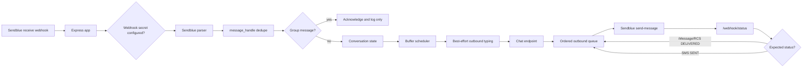

# Architecture

## Overview

`sendblue-ai-agent` receives Sendblue webhooks, dedupes inbound message retries,
buffers rapid direct-message bursts, calls a configurable HTTP chat endpoint,
and delivers replies through Sendblue in order using status callbacks. The
package stays transport/orchestration focused: the developer owns the chat
endpoint and any model, prompt, account, or product logic behind it.

v0.2 centers on direct iMessage/SMS/RCS conversations. Group messages are
acknowledged and logged but remain silent until group routing is designed in
v0.4.

## Components

- `src/index.ts` - package exports, runtime startup, default HTTP clients.
- `src/http/` - Express app, routes, webhook secret validation.
- `src/sendblue/` - Sendblue payload types, parsers, webhook paths, outbound API client.
- `src/chat/` - chat endpoint request/response types and HTTP client.
- `src/conversation/` - direct conversation state machine, buffering, BullMQ timers, stores, chat request assembly.
- `src/status/` - Sendblue status history tracking.
- `src/identity/` - optional phone-based identity resolver.
- `tests/unit/` - hardware-free parser, config, client, state helper, and resolver tests.
- `tests/integration/` - Express app and conversation intelligence flows with injected fake dependencies.
- `tests/e2e/` and `scripts/e2e/` - real-device Sendblue/iMessage harness.

## Data flow

## Runtime storage

With `REDIS_URL`, conversation state is stored under Sendblue-agent Redis keys,
dedupe uses `SET NX` with `DEDUPE_TTL_SECONDS`, outbound handles are mapped back
to conversation keys, and BullMQ schedules delayed buffer processing. This is
the production path.

Without `REDIS_URL`, the app uses in-memory maps and timers. This keeps tests
and local experiments simple, but state disappears on restart and cannot
coordinate more than one process.

## Key design decisions

- Direct conversations use `direct:{sendblueLine}:{phoneNumber}` and maintain
  one mutable state record across iMessage, RCS, SMS, and downgrade changes.
- Rapid inbound bursts are aggregated into a backward-compatible top-level
  `message` string plus structured `messages[]`.
- Ordered delivery waits for `DELIVERED` on iMessage/RCS and `SENT` on SMS or
  downgraded conversations.
- Sendblue `status_callback` is supplied on every outbound `send-message`
  request; there is no assumed global callback.
- Typing indicators are best effort and only emitted for direct iMessage
  conversations that are not SMS-downgraded.
- Inbound typing state is stored and included in the next chat request; typing
  events alone do not call the chat endpoint.
- Identity resolution is optional and fail-open.

## Feature inventory

- [Configuration and tunables](features/configuration.md)
- [Inbound webhooks](features/inbound-webhooks.md)
- [Message buffering and interruptions](features/message-buffering.md)
- [Ordered delivery](features/ordered-delivery.md)
- [Typing indicators](features/typing-indicators.md)
- [Identity resolver](features/identity-resolver.md)
- [Conversation state and chat contract](features/conversation-state.md)
- [Testing infrastructure](TESTING.md)
- [Observed Sendblue payload structures](SENDBLUE-PAYLOAD-STRUCTURES.md)

## Known limitations

- Group routing, media send behavior, reactions, send effects, retries/backoff,
  and richer operational diagnostics remain roadmap work.
- Delivery timeout timers are process-local even when Redis stores queue
  mappings.
- The real Sendblue/iMessage path still requires macOS Messages.app, a dedicated
  Sendblue line, public tunnel, and captured webhook validation.
