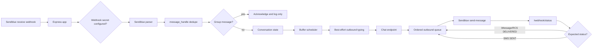

# Architecture

## Overview

`sendblue-ai-agent` receives Sendblue webhooks, dedupes inbound message retries,
buffers rapid direct-message bursts, calls a configurable HTTP chat endpoint,
and delivers replies through Sendblue in order using status callbacks. The
package stays transport/orchestration focused: the developer owns the chat
endpoint and any model, prompt, account, or product logic behind it.

v0.2 centers on direct iMessage/SMS/RCS conversations. Group messages are
acknowledged and logged but remain silent until group routing is designed in
v0.4.

## Components

- `src/index.ts` - package exports, runtime startup, default HTTP clients.
- `src/http/` - Express app, routes, webhook secret validation, trace middleware (`trace.ts`), shared admin auth (`auth.ts`), PII redaction (`redaction.ts`), `/health` and `/ready` handlers, `/metrics` endpoint, and the `/admin/*` introspection set (`admin.ts`).
- `src/sendblue/` - Sendblue payload types, parsers, webhook paths, outbound API client.
- `src/chat/` - chat endpoint request/response types and HTTP client.
- `src/conversation/` - direct conversation state machine, buffering, BullMQ timers, stores, chat request assembly. The conversation record carries an optional `traceId`; outbound handle mappings persist it so status callbacks recover the original trace. `ConversationAgent.recoverPendingRetries()` re-arms transient-retry and SMS-limit-stall timers from persisted state at boot.
- `src/status/` - Sendblue status history tracking.
- `src/identity/` - optional phone-based identity resolver.
- `src/limits/` - Agent-plan limit counters (in-memory + Redis), per-line token-bucket pacer, transient-retry/SMS-limit-stall helpers.
- `src/metrics/` - `MetricsCollector` interface, in-memory + noop implementations with per-metric label-cardinality cap, named registry (`createAgentMetrics`), Prometheus text-format renderer.
- `tests/unit/` - hardware-free parser, config, client, state helper, resolver, metrics, and redaction tests.
- `tests/integration/` - Express app and conversation intelligence flows with injected fake dependencies (metrics, trace propagation, admin introspection, health/ready).
- `tests/e2e/` and `scripts/e2e/` - real-device Sendblue/iMessage harness.

## Data flow

## Runtime storage

With `REDIS_URL`, conversation state is stored under Sendblue-agent Redis keys,
dedupe uses `SET NX` with `DEDUPE_TTL_SECONDS`, outbound handles are mapped back
to conversation keys, and BullMQ schedules delayed buffer processing. This is
the production path.

Without `REDIS_URL`, the app uses in-memory maps and timers. This keeps tests
and local experiments simple, but state disappears on restart and cannot
coordinate more than one process.

## Key design decisions

- Direct conversations use `direct:{sendblueLine}:{phoneNumber}` and maintain
  one mutable state record across iMessage, RCS, SMS, and downgrade changes.
- Rapid inbound bursts are aggregated into a backward-compatible top-level
  `message` string plus structured `messages[]`.
- Ordered delivery waits for `DELIVERED` on iMessage and `SENT` on SMS or
  downgraded conversations. RCS is treated like iMessage and advances on
  `DELIVERED` by default, but Sendblue's public docs do not document RCS
  terminal-state semantics — pin against a captured live RCS callback before
  v1.0 (see `docs/features/ordered-delivery.md`).
- Sendblue `status_callback` is supplied on every outbound `send-message`
  request; there is no assumed global callback.
- Typing indicators are best effort and only emitted for direct iMessage
  conversations that are not SMS-downgraded.
- Inbound typing state is stored and included in the next chat request when the
  account can register Sendblue's documented `typing_indicator` webhook; typing
  events alone do not call the chat endpoint.
- Identity resolution is optional and fail-open.
- Operational visibility is in-tree, dependency-free, and provider-neutral.
  Metrics flow through a `MetricsCollector` (in-memory by default, Noop when
  unconfigured); a hand-rolled Prometheus renderer serves `GET /metrics`. A
  per-request `traceId` is generated at webhook ingest, stored on the
  conversation record + outbound handle mapping, and chained back into status
  callbacks as `conversationTraceId`. PII (phone numbers, message content)
  is redacted in introspection responses unless the operator passes
  `?reveal=true`.

## Operator surface

| Route | Auth | Purpose |
| --- | --- | --- |
| `GET /health` | none | Liveness — uptime, version, node version. |
| `GET /ready` | none | Redis ping + buffer scheduler stats; 503 on dependency failure. |
| `GET /metrics` | `ADMIN_API_TOKEN` | Prometheus text exposition. Mounted only when the token is set. |
| `GET /admin/limits` | `ADMIN_API_TOKEN` | Per-line `LimitSnapshot`. |
| `GET /admin/conversations/:key` | `ADMIN_API_TOKEN` | Conversation record. Redacted by default; `?reveal=true` unmasks. |
| `GET /admin/status/:messageHandle` | `ADMIN_API_TOKEN` | `StatusRecord` with full callback history (redacted). |
| `GET /admin/queue` | `ADMIN_API_TOKEN` | Buffer scheduler kind + counts. |
| `GET /admin/dedupe?messageHandle=...` | `ADMIN_API_TOKEN` | Non-destructive inbound dedupe presence/TTL probe. |

## Feature inventory

- [Configuration and tunables](features/configuration.md)
- [Inbound webhooks](features/inbound-webhooks.md)
- [Outbound Sendblue client](features/outbound-client.md)
- [Webhook security](features/webhook-security.md)
- [Message buffering and interruptions](features/message-buffering.md)
- [Ordered delivery](features/ordered-delivery.md)
- [Status tracking](features/status-tracking.md)
- [Typing indicators](features/typing-indicators.md)
- [Identity resolver](features/identity-resolver.md)
- [Conversation state and chat contract](features/conversation-state.md)
- [Rich chat actions](features/rich-chat-actions.md)
- [Sendblue contact upsert](features/contact-upsert.md)
- [Sendblue Agent-plan limit tracking](features/plan-limits.md)
- [Operational visibility (metrics, tracing, health, introspection)](features/operational-visibility.md)
- [Testing infrastructure](TESTING.md)
- [Observed Sendblue payload structures](SENDBLUE-PAYLOAD-STRUCTURES.md)

## Known limitations

- Delivery timeout timers and the SMS-limit stall scheduler are
  process-local even when Redis stores per-line counters and stall
  metadata. Multi-replica deploys schedule independent retries; the
  Lua-backed pacing slot still keeps total send rate at ~1/s.
  `ConversationAgent.recoverPendingRetries()` re-arms persisted timers
  on boot via Redis SCAN — best-effort and non-blocking, with the
  `runRetry` item-identity check dropping any double-fire across
  replicas.
- RCS terminal-status is assumed to be `DELIVERED` (matching iMessage); not
  yet verified against a captured live RCS callback.
- The real Sendblue/iMessage path still requires macOS Messages.app, a dedicated
  Sendblue line, public tunnel, and captured webhook validation.
- Sendblue's contact endpoints other than `create` (list, get, update,
  delete, bulk, opt-out) and operator endpoints (`evaluate-service`,
  `send-carousel`, `modify-group`, `upload-media-object`, the v2
  `messages` resource, `account/webhooks` CRUD) remain out of scope —
  see `docs/features/outbound-client.md`.
